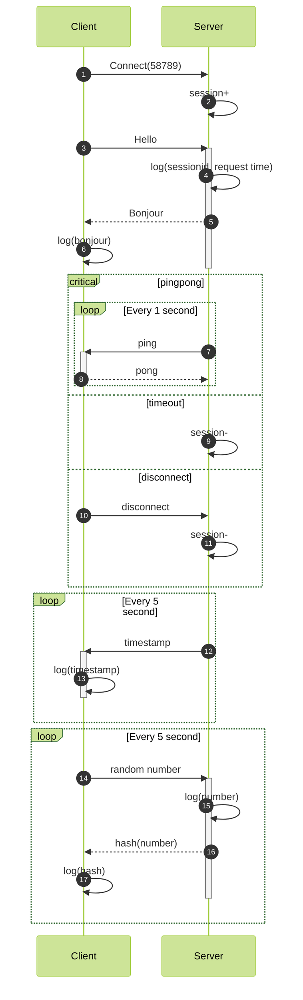

# Hello Websocket


## Prompt

```markdown
使用python的websockets库，实现websocket的服务端和客户端：

1. 端口号约定为58789，
2. 请求是json格式，包含头和体，头包含userId和消息序号(seq)(时间戳),体包含消息类型(ping/pong/req/resp)和消息内容(只有req类型的有内容)。示例：{"header": {"userId": "client_159", "seq": 1719079259.356038}, "body": {"type": "req", "content": "30"}}
4. 响应是json格式，包含头和体，头包含延迟(latency)(单位毫秒)和消息序号(seq)，体包含消息类型和消息内容。示例：{'header': {'latency': 1, 'seq': 1719079234.335238}, 'body': {'type': 'resp', 'content': '7688b6ef52555962d008fff894223582c484517cea7da49ee67800adc7fc8866'}}
5. 服务端和客户端实现pingpong，间隔1秒，双方都打印pingpong信息
6. 服务端维护session，在建立连接时加入、在pingpong失效或者断开连接时摘除
7. 客户端建立连接后请求hello，服务端打印请求者session id和请求时间返回bonjour
8. 客户端接收bonjour后打印输出
9. 在服务端，独立于接收线程，每隔5秒发送当前时间给客户端；客户端打印服务端时间信息
10. 在客户端，独立于接收线程，每隔5秒，一个随机数给服务端；服务端打印这个随机数，并将这个随机数的hash值响应给客户端；客户端收到后打印hash值。
```




