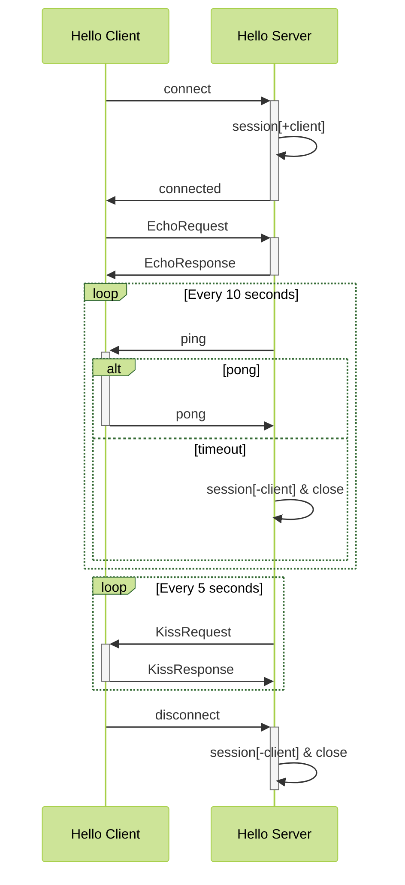

<!-- markdownlint-disable MD033 MD045 -->

# Hello Websocket

## :coffee: Protocol

### Upstream

REQEUST

```json
{
  "id": 1,
  "data": "请求数据",
  "meta": "客户端语言"
}
```

RESPONSE

```json
{
  "status": 200,
  "results": [
    {
      "id": 1234567890,
      "type": "OK",
      "kv": {
        "id": "uuid",
        "idx": "1",
        "data": "响应数据",
        "meta": "服务器端语言"
      }
    },
  ]
}
```

### Downstream

REQEUST

```json
{
    "os_name": "Windows",
    "os_version": "10.0.19042",
    "os_release": "10",
    "os_architecture": "AMD64"
}
```

RESPONSE

```json
{
    "language": "en_US",
    "encoding": "UTF-8",
    "time_zone": "UTC"
}
```

## :coffee: Diagram



## :coffee: Features

- protocol send/receive
- header
- ping/pong
- handshake
- tls

## :coffee:  Langues

1. [hello-websocket-java](hello-websocket-java)
1. [hello-websocket-go](hello-websocket-go)
1. [hello-websocket-rust](hello-websocket-rust)
1. [hello-websocket-python](hello-websocket-python)
1. [hello-websocket-nodejs](hello-websocket-nodejs)

## :coffee: Build & Ship

- [docker](docker)
  
## :coffee: Recommend

<https://github.com/facundofarias/awesome-websockets>

## :coffee: Stars

[](https://star-history.com/#feuyeux/hello-websocket&Date)
