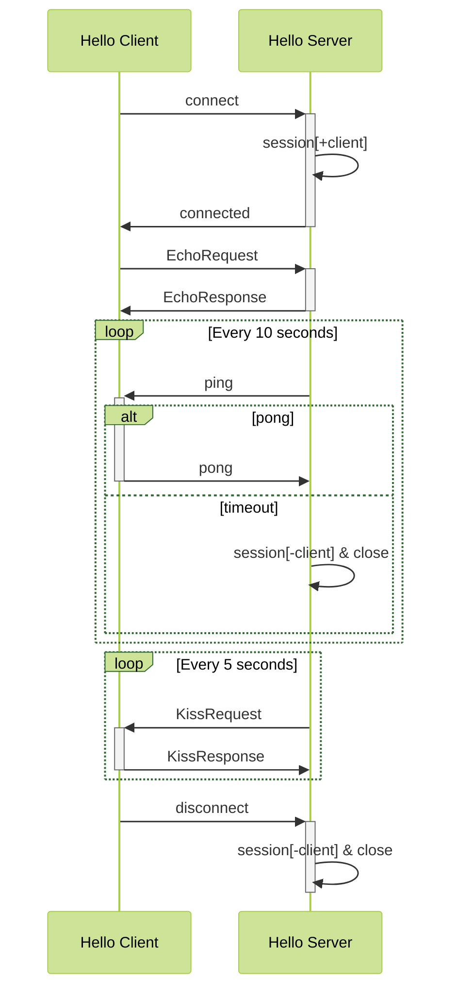

# Hello WebSocket

WebSocket server and client implementations in **12 programming languages**, mirroring the [hello-grpc](https://github.com/feuyeux/hello-grpc) project.

Each language implements the same **binary WebSocket protocol** defined in [PROTOCOL.md](PROTOCOL.md), with communication patterns mapped from gRPC:

| gRPC Pattern | WebSocket Message |
|---|---|
| Unary (Talk) | `ECHO_REQUEST` → `ECHO_RESPONSE` |
| Server Streaming (TalkOneAnswerMore) | `ECHO_REQUEST` → `ECHO_RESPONSE` (multiple results) |
| Client Streaming (TalkMoreAnswerOne) | `RANDOM_NUMBER` → `HASH_RESPONSE` |
| Bidirectional (TalkBidirectional) | `HELLO`/`BONJOUR`, `PING`/`PONG`, `KISS_REQUEST`/`KISS_RESPONSE` |

**Default port:** `9898` (env: `WS_SERVER_PORT`)

## Languages and Libraries

| # | Language | Library | Build Tool | Directory |
|---|---|---|---|---|
| 1 | Java | Java-WebSocket + Gson | Maven | [`hello-websocket-java/`](hello-websocket-java) |
| 2 | Kotlin | Ktor Server-WS + Ktor Client-WS | Gradle | [`hello-websocket-kotlin/`](hello-websocket-kotlin) |
| 3 | Python | websockets | pip | [`hello-websocket-python/`](hello-websocket-python) |
| 4 | Go | gorilla/websocket | go modules | [`hello-websocket-go/`](hello-websocket-go) |
| 5 | Rust | tokio-tungstenite | cargo | [`hello-websocket-rust/`](hello-websocket-rust) |
| 6 | C++ | Boost.Beast + nlohmann/json | CMake | [`hello-websocket-cpp/`](hello-websocket-cpp) |
| 7 | C# | System.Net.WebSockets (.NET 9) | dotnet | [`hello-websocket-csharp/`](hello-websocket-csharp) |
| 8 | Dart | shelf_web_socket + web_socket_channel | pub | [`hello-websocket-dart/`](hello-websocket-dart) |
| 9 | PHP | Ratchet + textalk/websocket | composer | [`hello-websocket-php/`](hello-websocket-php) |
| 10 | Swift | NIOWebSocket (swift-nio) | SPM | [`hello-websocket-swift/`](hello-websocket-swift) |
| 11 | Node.js | ws | npm | [`hello-websocket-nodejs/`](hello-websocket-nodejs) |
| 12 | TypeScript | ws + @types/ws | npm | [`hello-websocket-ts/`](hello-websocket-ts) |

## Binary Protocol

All 12 languages implement the canonical binary protocol defined in [PROTOCOL.md](PROTOCOL.md). Every WebSocket binary frame carries one message wrapped in an 8-byte header:

```
Offset  Size  Field
0       1     MAGIC        0x48 ('H')
1       1     VERSION      0x01
2       1     MSG_TYPE     Message type discriminator
3       1     FLAGS        Reserved (0x00)
4       4     PAYLOAD_LEN  uint32 big-endian
8       N     PAYLOAD      N bytes
```

Message types: `HELLO`, `BONJOUR`, `ECHO_REQUEST`, `ECHO_RESPONSE`, `KISS_REQUEST`, `KISS_RESPONSE`, `PING`, `PONG`, `TIME_NOTIFICATION`, `RANDOM_NUMBER`, `HASH_RESPONSE`, `DISCONNECT`, `ERROR`.

See [PROTOCOL.md](PROTOCOL.md) for full payload definitions, session lifecycle, timing intervals, and a worked byte-level example.

## Running Locally

### Python
```bash
cd hello-websocket-python
pip install -r requirements.txt
python server/ws_server.py

# Client (separate terminal)
python client/ws_client.py
```

### Go
```bash
cd hello-websocket-go
go run server/main.go
go run client/main.go
```

### Node.js
```bash
cd hello-websocket-nodejs
npm install
node server/ws_server.js
node client/ws_client.js
```

### Java
```bash
cd hello-websocket-java
mvn clean package -DskipTests
java -jar target/hello-websocket-java-1.0.0.jar
java -cp target/hello-websocket-java-1.0.0.jar io.github.hellowebsocket.WsClient
```

### Rust
```bash
cd hello-websocket-rust
cargo run --bin ws-server
cargo run --bin ws-client
```

### TypeScript
```bash
cd hello-websocket-ts
npm install
npx ts-node --esm server/ws_server.ts
npx ts-node --esm client/ws_client.ts
```

### C++
```bash
cd hello-websocket-cpp
cmake -B build -DCMAKE_BUILD_TYPE=Release
cmake --build build
./build/ws_server
./build/ws_client
```

### C#
```bash
cd hello-websocket-csharp
dotnet run -c Release            # server
dotnet run -c Release -- client  # client
```

### Dart
```bash
cd hello-websocket-dart
dart pub get
dart run server/ws_server.dart
dart run client/ws_client.dart
```

### Kotlin
```bash
cd hello-websocket-kotlin
./gradlew :server:installDist :client:installDist
./server/build/install/server/bin/server
./client/build/install/client/bin/client
```

### PHP
```bash
cd hello-websocket-php
composer install
php server/ws_server.php
php client/ws_client.php
```

### Swift
```bash
cd hello-websocket-swift
swift run
```

## Running with Docker

```bash
cd docker

# Build all images
./build_image.sh --all

# Build specific language
./build_image.sh --language java

# Run server
./run_container.sh --language java --component server

# Run client (separate terminal)
./run_container.sh --language go --component client

# Cross-language: Java server + Go client
./run_container.sh --language java --component server
./run_container.sh --language go --component client

# Push images to registry
./push_image.sh --all
```

## Environment Variables

| Variable | Default | Description |
|---|---|---|
| `WS_SERVER_PORT` | `9898` | Server listen port |
| `WS_SERVER_HOST` | `127.0.0.1` | Server host (client only) |

## Shared Greeting Data

All 12 implementations share the same multilingual greeting dataset:

| Index | Hello | Answer |
|---|---|---|
| 0 | Hello | Thank you very much |
| 1 | Bonjour | Merci beaucoup |
| 2 | Hola | Muchas Gracias |
| 3 | こんにちは | どうもありがとう |
| 4 | Ciao | Mille Grazie |
| 5 | 안녕하세요 | 대단히 감사합니다 |
| 6 | 你好 | 非常感谢 |
| 7 | Olá | Muito Obrigado |
| 8 | Hallo | Vielen Dank |
| 9 | Привет | Большое спасибо |
| 10 | Merhaba | Çok teşekkürler |
| 11 | Xin chào | Cảm ơn bạn nhiều |

## Features

- Binary frame protocol with 8-byte header (magic, version, message type, length)
- Handshake: HELLO / BONJOUR
- Echo: ECHO_REQUEST / ECHO_RESPONSE
- Downstream kiss: KISS_REQUEST / KISS_RESPONSE
- Heartbeat: PING / PONG (1s interval, 60s session timeout)
- Time broadcast: TIME_NOTIFICATION (5s interval)
- Random to hash: RANDOM_NUMBER / HASH_RESPONSE (SHA-256, 5s interval)
- Error handling with protocol error codes
- Cross-language interoperability
- TLS support
- Docker multi-stage builds for all 12 languages

## Recommend

<https://github.com/facundofarias/awesome-websockets>

## Star History

[](https://star-history.com/#feuyeux/hello-websocket&Date)
# Hello WebSocket

WebSocket server and client implementations in **12 programming languages**, mirroring the [hello-grpc](https://github.com/feuyeux/hello-grpc) project.

Each language implements the same JSON-based WebSocket protocol with four communication patterns mapped from gRPC:

| gRPC Pattern | WebSocket Action |
|---|---|
| Unary (Talk) | `echo` — send one message, receive one reply |
| Server Streaming (TalkOneAnswerMore) | `server_stream` — send CSV indices, receive multiple replies |
| Client Streaming (TalkMoreAnswerOne) | `client_stream` / `client_stream_end` — send multiple, receive summary |
| Bidirectional (TalkBidirectional) | `bidi_start` / `bidi` / `bidi_end` — interleaved send/receive |

**Default port:** `9996` (env: `WS_SERVER_PORT`)

## Languages and Libraries

| # | Language | Library | Build Tool | Directory |
|---|---|---|---|---|
| 1 | Java | Java-WebSocket + Gson | Maven | `hello-websocket-java/` |
| 2 | Kotlin | Ktor Server-WS + Ktor Client-WS | Gradle | `hello-websocket-kotlin/` |
| 3 | Python | websockets | pip | `hello-websocket-python/` |
| 4 | Go | gorilla/websocket | go modules | `hello-websocket-go/` |
| 5 | Rust | tokio-tungstenite | cargo | `hello-websocket-rust/` |
| 6 | C++ | Boost.Beast + nlohmann/json | CMake | `hello-websocket-cpp/` |
| 7 | C# | System.Net.WebSockets (.NET 9) | dotnet | `hello-websocket-csharp/` |
| 8 | Dart | shelf_web_socket + web_socket_channel | pub | `hello-websocket-dart/` |
| 9 | PHP | Ratchet + textalk/websocket | composer | `hello-websocket-php/` |
| 10 | Swift | NIOWebSocket (swift-nio) | SPM | `hello-websocket-swift/` |
| 11 | Node.js | ws | npm | `hello-websocket-nodejs/` |
| 12 | TypeScript | ws + @types/ws | npm | `hello-websocket-ts/` |

## JSON Protocol

**Request:**
```json
{
  "action": "echo|server_stream|client_stream|client_stream_end|bidi_start|bidi|bidi_end",
  "data": "<language_index or csv>",
  "meta": "<CLIENT_LANG>"
}
```

**Response:**
```json
{
  "status": 200,
  "results": [{
    "id": <unix_timestamp>,
    "type": 0,
    "kv": {
      "id": "<uuid>",
      "idx": "<index>",
      "data": "<hello>,<answer>",
      "meta": "<SERVER_LANG>"
    }
  }]
}
```

## Running Locally

### Python
```bash
# Server
cd hello-websocket-python
pip install -r requirements.txt
python server/ws_server.py

# Client (separate terminal)
python client/ws_client.py
```

### Go
```bash
cd hello-websocket-go
go run server/ws_server.go
go run client/ws_client.go
```

### Node.js
```bash
cd hello-websocket-nodejs
npm install
node src/server/index.js
node src/client/index.js
```

### Java
```bash
cd hello-websocket-java
mvn clean package -DskipTests
java -jar target/hello-ws-java-server.jar
java -jar target/hello-ws-java-client.jar
```

### Rust
```bash
cd hello-websocket-rust
cargo run --bin ws-server
cargo run --bin ws-client
```

## Running with Docker

```bash
# Build all images
cd docker
./build_image.sh

# Build specific language
./build_image.sh python

# Run server
./run_container.sh server python

# Run client (separate terminal)
./run_container.sh client python

# Cross-language: Java server + Go client
./run_container.sh server java
./run_container.sh client go
```

## Environment Variables

| Variable | Default | Description |
|---|---|---|
| `WS_SERVER_PORT` | `9996` | Server listen port |
| `WS_SERVER_HOST` | `127.0.0.1` | Server host (client only) |

## Shared Greeting Data

All 12 implementations share the same multilingual greeting dataset:

| Index | Hello | Answer |
|---|---|---|
| 0 | Hello | Thank you very much |
| 1 | Bonjour | Merci beaucoup |
| 2 | Hola | Muchas Gracias |
| 3 | こんにちは | どうもありがとう |
| 4 | Ciao | Mille Grazie |
| 5 | 안녕하세요 | 대단히 감사합니다 |
| 6 | 你好 | 非常感谢 |
| 7 | Olá | Muito Obrigado |
| 8 | Hallo | Vielen Dank |
| 9 | Привет | Большое спасибо |
| 10 | Merhaba | Çok teşekkürler |
| 11 | Xin chào | Cảm ơn bạn nhiều |
<!-- markdownlint-disable MD033 MD045 -->

# Hello Websocket

## :coffee: Protocol

### Upstream

REQEUST

```json
{
  "id": 1,
  "data": "请求数据",
  "meta": "客户端语言"
}
```

RESPONSE

```json
{
  "status": 200,
  "results": [
    {
      "id": 1234567890,
      "type": "OK",
      "kv": {
        "id": "uuid",
        "idx": "1",
        "data": "响应数据",
        "meta": "服务器端语言"
      }
    },
  ]
}
```

### Downstream

REQEUST

```json
{
    "os_name": "Windows",
    "os_version": "10.0.19042",
    "os_release": "10",
    "os_architecture": "AMD64"
}
```

RESPONSE

```json
{
    "language": "en_US",
    "encoding": "UTF-8",
    "time_zone": "UTC"
}
```

## :coffee: Diagram


```mermaid
%%{
  init: {
    'theme': 'forest'
  }
}%%
sequenceDiagram        
	Hello Client->>+Hello Server:connect
	Hello Server->>Hello Server:session[+client]
	Hello Server->>-Hello Client:connected
	Hello Client->>+Hello Server:EchoRequest
	Hello Server->>-Hello Client:EchoResponse
	
    loop Every 10 seconds
    	participant Hello Server
    	participant Hello Client
        Hello Server->>+Hello Client:ping
        alt pong
            Hello Client->>-Hello Server:pong
        else timeout
            Hello Server->>Hello Server:session[-client] & close
        end      
    end
    
    loop Every 5 seconds
        Hello Server->>+Hello Client:KissRequest
        Hello Client->>-Hello Server:KissResponse
    end
    
    Hello Client->>+Hello Server:disconnect
	Hello Server->>-Hello Server:session[-client] & close
```

## :coffee: Features

- protocol send/receive
- header
- ping/pong
- handshake
- tls

## :coffee:  Langues

1. [hello-websocket-java](hello-websocket-java)
1. [hello-websocket-go](hello-websocket-go)
1. [hello-websocket-rust](hello-websocket-rust)
1. [hello-websocket-python](hello-websocket-python)
1. [hello-websocket-nodejs](hello-websocket-nodejs)

## :coffee: Build & Ship

- [docker](docker)
  
## :coffee: Recommend

<https://github.com/facundofarias/awesome-websockets>

## :coffee: Stars

[](https://star-history.com/#feuyeux/hello-websocket&Date)
