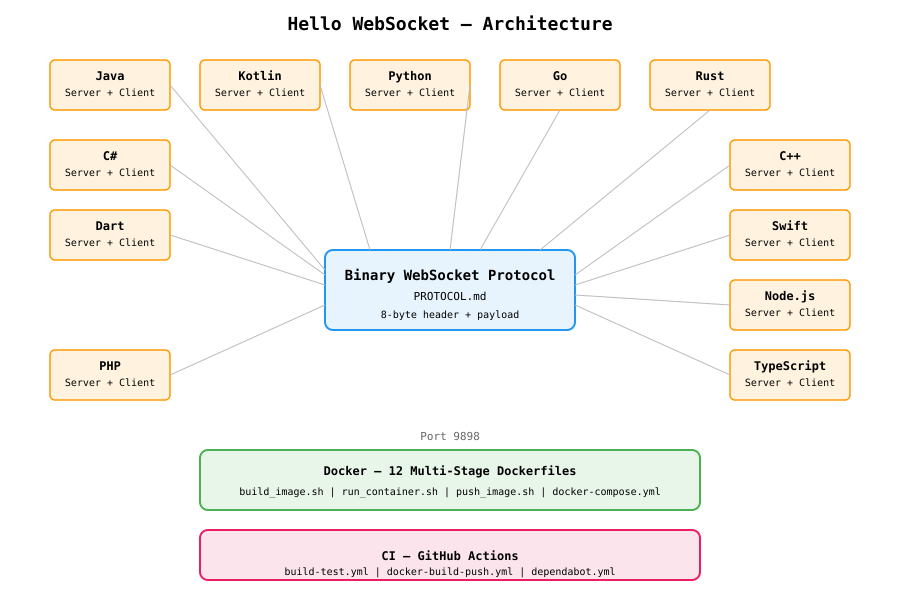
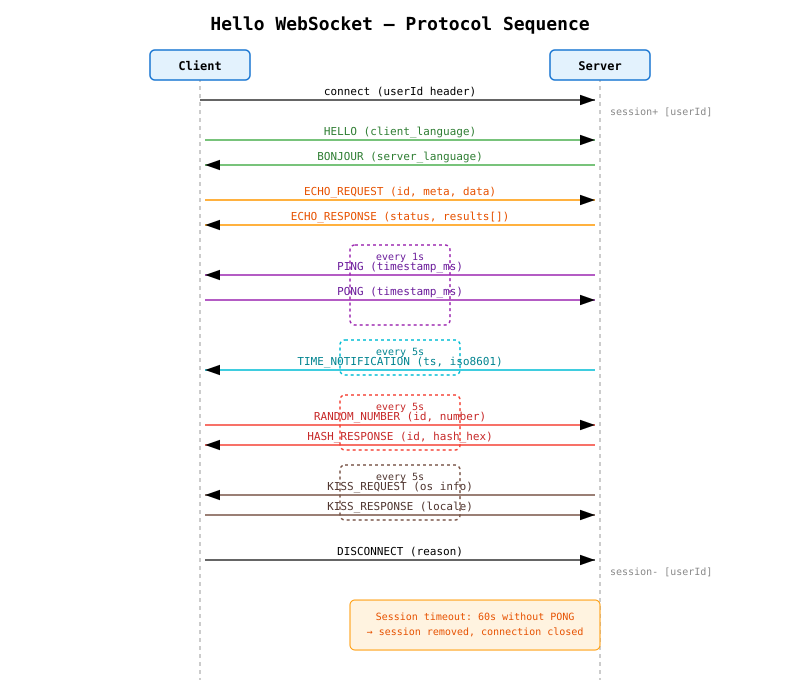

<!-- markdownlint-disable MD033 MD045 -->

# Hello WebSocket

**Equivalent WebSocket server and client implementations across 12 programming languages**

*Learn WebSocket and RFC 6455 internals through one shared binary protocol with CI-verified cross-language interoperability — Java, Kotlin, Python, Go, Rust, C++, C#, Dart, PHP, Swift, Node.js, and TypeScript*

---

*The sibling of [hello-grpc](https://github.com/feuyeux/hello-grpc): where hello-grpc shares a contract through protoc-generated stubs, this project hand-rolls one binary protocol as 12 language-native codecs — any client talks to any server, 12 × 12 combinations.*

[](https://github.com/feuyeux/hello-websocket/stargazers)
[](https://github.com/feuyeux/hello-websocket/network/members)
[](https://github.com/feuyeux/hello-websocket/issues)
[](https://github.com/feuyeux/hello-websocket/blob/main/LICENSE)
[](https://github.com/feuyeux/hello-websocket/actions/workflows/build-test.yml)

This repository demonstrates comparable WebSocket implementations across 12 programming languages, with Docker, docker-compose orchestration, shared protocol test vectors, and a fully automated dependency pipeline. It is a learning and interoperability repository rather than a drop-in production platform.

## Supported Programming Languages & Libraries

Each implementation ships **both a server and a client**, covers the same 13 message types defined in the shared binary contract [PROTOCOL.md](PROTOCOL.md), and is exercised by the same CI pipeline. Audited per-language details live in the [feature parity matrix](docs/PARITY_MATRIX.md).

| No. | Language                        | WebSocket Library                                                                                          | Build System                                      | Recommended IDE                                  |
|:----|:--------------------------------|:-----------------------------------------------------------------------------------------------------------|:--------------------------------------------------|:-------------------------------------------------|
| 1   | [C++](hello-websocket-cpp)      | **[dependency-free RFC 6455 layer](https://datatracker.ietf.org/doc/html/rfc6455)**                        | [CMake](https://cmake.org/)                       | [CLion](https://www.jetbrains.com/clion/)        |
| 2   | [Rust](hello-websocket-rust)    | **[tokio-tungstenite](https://github.com/snapview/tokio-tungstenite)**                                     | [Cargo](https://doc.rust-lang.org/cargo/)         | [RustRover](https://www.jetbrains.com/rust/)     |
| 3   | [Java](hello-websocket-java)    | **[Java-WebSocket](https://github.com/TooTallNate/Java-WebSocket)**                                        | [Maven](https://maven.apache.org/)                | [IntelliJ IDEA](https://www.jetbrains.com/idea/) |
| 4   | [Go](hello-websocket-go)        | **[gorilla/websocket](https://github.com/gorilla/websocket)**                                              | [Go Modules](https://go.dev/ref/mod)              | [GoLand](https://www.jetbrains.com/go/)          |
| 5   | [C#](hello-websocket-csharp)    | **[System.Net.WebSockets](https://learn.microsoft.com/en-us/dotnet/api/system.net.websockets)**            | [dotnet / NuGet](https://www.nuget.org/)          | [Rider](https://www.jetbrains.com/rider/)        |
| 6   | [Python](hello-websocket-python)| **[websockets](https://websockets.readthedocs.io/)**                                                       | [pip](https://pypi.org/project/websockets/)       | [PyCharm](https://www.jetbrains.com/pycharm/)    |
| 7   | [Node.js](hello-websocket-nodejs)| **[ws](https://github.com/websockets/ws)**                                                                 | [npm](https://www.npmjs.com/)                     | [WebStorm](https://www.jetbrains.com/webstorm/)  |
| 8   | [TypeScript](hello-websocket-ts)| **[ws](https://github.com/websockets/ws)** + [tsc](https://www.typescriptlang.org/docs/handbook/compiler-options.html) | [npm](https://www.npmjs.com/)        | [WebStorm](https://www.jetbrains.com/webstorm/)  |
| 9   | [Dart](hello-websocket-dart)    | **[dart:io WebSocket](https://api.dart.dev/stable/dart-io/WebSocket-class.html)**                          | [Pub](https://dart.dev/guides/packages)           | [Android Studio](https://developer.android.com/studio) |
| 10  | [Kotlin](hello-websocket-kotlin)| **[Ktor WebSockets](https://ktor.io/docs/websocket.html)**                                                 | [Gradle](https://gradle.org/)                     | [IntelliJ IDEA](https://www.jetbrains.com/idea/) |
| 11  | [Swift](hello-websocket-swift)  | **[dependency-free socket / RFC 6455 layer](https://datatracker.ietf.org/doc/html/rfc6455)**               | [SwiftPM](https://www.swift.org/package-manager/) | [Xcode](https://developer.apple.com/xcode/)      |
| 12  | [PHP](hello-websocket-php)      | **[Ratchet](http://socketo.me/) server + [Pawl](https://github.com/ratchetphp/Pawl) client**               | [Composer](https://getcomposer.org/)              | [PhpStorm](https://www.jetbrains.com/phpstorm/)  |

## Architecture & Protocol



### Message Flows

Every implementation exercises the same six flows on the canonical endpoint `ws://<host>:9898/ws`:

1. **Handshake** — client announces its language (HELLO), server answers with its own (BONJOUR)
2. **Echo** — request/response with correlated ids (ECHO_REQUEST / ECHO_RESPONSE)
3. **Kiss** — server asks for OS info, client replies with locale (KISS_REQUEST / KISS_RESPONSE)
4. **Heartbeat** — application-level PING/PONG every 1s, 60s session timeout
5. **Time broadcast** — server pushes TIME_NOTIFICATION every 5s
6. **Random to hash** — client pushes RANDOM_NUMBER every 5s, server replies with a SHA-256 HASH_RESPONSE

### Wire Format

Each binary WebSocket message carries exactly one protocol frame:

```text
Offset  Size  Field
0       1     MAGIC        0x48 ('H')
1       1     VERSION      0x01
2       1     MSG_TYPE
3       1     FLAGS
4       4     PAYLOAD_LEN  uint32 big-endian
8       N     PAYLOAD
```

The protocol supports HELLO/BONJOUR, echo, application heartbeat,
time notification, OS/locale exchange, random-number hashing, disconnect,
and typed errors. Frames are limited to 1 MiB. The canonical contract,
including a byte-level worked example, is [PROTOCOL.md](PROTOCOL.md).



## Feature Parity Matrix

| Language   | Server | Client | Full Protocol | Codec Tests | Docker | Compose | Cross-language Smoke |
|:-----------|:-------|:-------|:--------------|:------------|:-------|:--------|:---------------------|
| C++        | ✅     | ✅     | ✅            | ✅          | ✅     | ✅      | ✅                   |
| Rust       | ✅     | ✅     | ✅            | ✅          | ✅     | ✅      | ✅                   |
| Java       | ✅     | ✅     | ✅            | ✅          | ✅     | ✅      | ✅                   |
| Go         | ✅     | ✅     | ✅            | ✅          | ✅     | ✅      | ✅                   |
| C#         | ✅     | ✅     | ✅            | ✅          | ✅     | ✅      | ✅                   |
| Python     | ✅     | ✅     | ✅            | ✅          | ✅     | ✅      | ✅                   |
| Node.js    | ✅     | ✅     | ✅            | ✅          | ✅     | ✅      | ✅                   |
| TypeScript | ✅     | ✅     | ✅            | ✅          | ✅     | ✅      | ✅                   |
| Dart       | ✅     | ✅     | ✅            | ✅          | ✅     | ✅      | ✅                   |
| Kotlin     | ✅     | ✅     | ✅            | ✅          | ✅     | ✅      | ✅                   |
| Swift      | ✅     | ✅     | ✅            | ✅          | ✅     | ✅      | ✅                   |
| PHP        | ✅     | ✅     | ✅            | ✅          | ✅     | ✅      | ✅                   |

TLS (`wss://`), authentication, and rate limiting are intentionally out of
scope — see [Security Scope](#security-scope). How each cell is verified is
documented in [docs/PARITY_MATRIX.md](docs/PARITY_MATRIX.md).

## Configuration

| Variable | Default | Purpose |
|---|---|---|
| `WS_SERVER` | `127.0.0.1` | Client target host |
| `WS_PORT` | `9898` | Server/client port |
| `WS_PATH` | `/ws` | WebSocket endpoint path |

## Build and Test

Each language directory contains `scripts/build.sh`. Examples:

```bash
./hello-websocket-go/scripts/build.sh
./hello-websocket-python/scripts/build.sh
./hello-websocket-java/scripts/build.sh
./hello-websocket-rust/scripts/build.sh
```

The CI workflow builds and tests every implementation. Codec tests cover the
worked example, all message types, malformed frames, signed integer boundaries,
and multilingual UTF-8. Canonical vectors are shared across all 12 languages
via [tests/protocol-vectors.json](tests/protocol-vectors.json), with
[tests/reference_client.py](tests/reference_client.py) as the reference peer.
Docker smoke tests verify HELLO/BONJOUR and PING/PONG across languages.

Dependency updates are managed across all ecosystems by Dependabot, dependency
review, OSV scanning, and guarded auto-merge. See
[docs/DEPENDENCY_AUTOMATION.md](docs/DEPENDENCY_AUTOMATION.md).

## Run Locally

Start a server and client in separate terminals:

```bash
./hello-websocket-python/scripts/run-server.sh
./hello-websocket-go/scripts/run-client.sh
```

All clients and servers share the same endpoint and wire protocol, so **any
server can be combined with any client** — 12 servers × 12 clients. Set
`WS_SERVER`, `WS_PORT`, or `WS_PATH` when required.

## Docker

```bash
cd docker
./build_image.sh --language java
./run_container.sh --language java --component server
./run_container.sh --language go --component client
./smoke_test_all.sh --server java
```

Per-language multi-stage Dockerfiles (`Dockerfile.<lang>`) build
`feuyeux/ws_server_<lang>` and `feuyeux/ws_client_<lang>` images, and
`docker-compose.yml` plus 12 per-language `docker-compose.<lang>.yml` files
provide one-command orchestration. Set `IMAGE_TAG` to build, run, or push a
tag other than `1.0.0`.

## Security Scope

This repository is an interoperability and teaching project. The included
servers use plain `ws://`; they do not implement authentication or
authorization, and `userId` is untrusted display metadata.

For deployment outside a trusted network, terminate TLS at a reverse proxy,
authenticate the upgrade request, restrict browser Origins, rate-limit
connections/messages, and run containers with an appropriate non-root policy.

## Project Statistics

[](https://star-history.com/#feuyeux/hello-websocket&Date)

## License

[Apache License 2.0](LICENSE)
