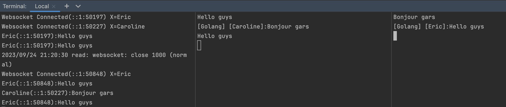

# Hello websocket

## dependent libs

<github.com/gorilla/websocket>

```sh
go mod init hello-websocket
go env -w GO111MODULE=on
go mod tidy
```

## run server

```sh
go run server/echo_server.go
```

## run client

```sh
go run client/echo_client.go Eric
```

```sh
go run client/echo_client.go Caroline
```


