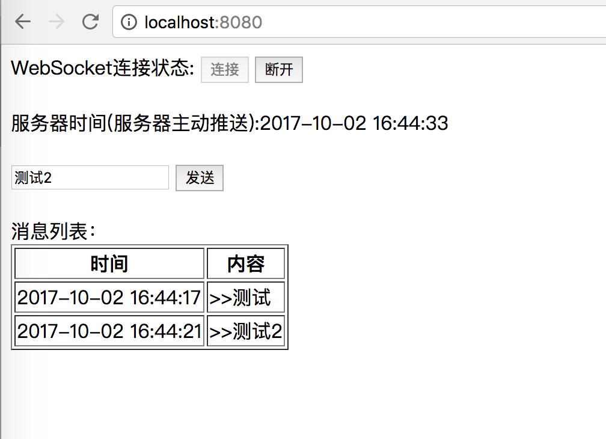

<!-- markdown-disable MD033 MD045 -->

# hello websocket java(spring-boot)

| spring-boot-starter-tomcat | spring-cloud     | spring-core | tomcat-embed-core | Servlet Spec | WebSocket Spec | JDK |
|:---------------------------|:-----------------|:------------|:------------------|:-------------|:---------------|:----|
|                            |                  |             | 11.0.x            | 6.1          | 2.2(TBD)       | 21+ |
| 3.2.2                      | 2023.0.x(Leyton) | 6.1.3       | 10.1.18           | 6.0          | 2.1            | 11+ |

- [spring-boot-starter-tomcat 3.2.2](https://mvnrepository.com/artifact/org.springframework.boot/spring-boot-starter-tomcat/3.2.2)
- [spring-cloud 2023.0.x(Leyton)](https://mvnrepository.com/artifact/org.springframework.cloud/spring-cloud-dependencies/2023.0.0-M1)
- [spring-core 6.1.3](https://mvnrepository.com/artifact/org.springframework/spring-core/6.1.3)
- [tomcat-embed-core 10.1.18](https://mvnrepository.com/artifact/org.apache.tomcat.embed/tomcat-embed-core/10.1.18)
- [servlet 6.1](https://mvnrepository.com/artifact/jakarta.servlet/jakarta.servlet-api/6.1)
- [servlet 6.0](https://mvnrepository.com/artifact/jakarta.servlet/jakarta.servlet-api/6.0)
- [websocket 2.1](https://mvnrepository.com/artifact/jakarta.websocket/jakarta.websocket-api/2.1)

```bash
mvn clean spring-boot:run
```

```bash
open http://localhost:8080
```



