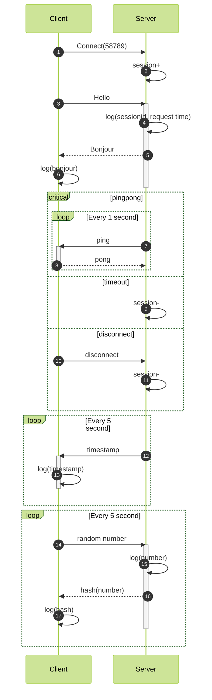

## Prompt

使用python的websockets库，分别实现websocket的服务端和客户端，给出详细的代码注释。功能需求描述如下：

使用golang的<github.com/gorilla/websocket>库，分别实现websocket的服务端和客户端，给出详细的代码注释。功能需求描述如下：

使用java的netty库，分别实现websocket的服务端和客户端，给出详细的代码注释。功能需求描述如下：

使用rust的tungstenite库，分别实现websocket的服务端和客户端，给出详细的代码注释。功能需求描述如下：

使用nodejs的ws库，分别实现websocket的服务端和客户端，给出详细的代码注释。功能需求描述如下：

```markdown
1. 端口号约定为58789，请求头包含userId
2. 请求体包含消息类型(ping/pong/req/resp)和消息内容(只有req类型的有内容)。示例：{"type": "req", "content": "30"}
3. 响应体包含消息类型和消息内容。示例：{'type': 'resp', 'content': '7688b6ef5'}
4. 服务端实现ping方法,客户端pong方法，间隔1秒，双方都打印ping/pong信息
5. 服务端维护session，在建立连接时加入、在pong超时(60秒)失效或者断开连接时摘除
6. 客户端建立连接后请求hello，服务端打印请求者session id并返回bonjour，客户端接收bonjour后打印输出
7. 在服务端，独立于接收线程，每隔5秒发送当前时间给客户端，方法名为send time；客户端打印服务端时间信息
8. 在客户端，独立于接收线程，每隔5秒，一个随机数给服务端，方法名为 send number；服务端打印这个随机数，并将这个随机数的hash值响应给客户端；客户端收到后打印hash值。
```

流程描述如下(使用了mermaid语法)：


